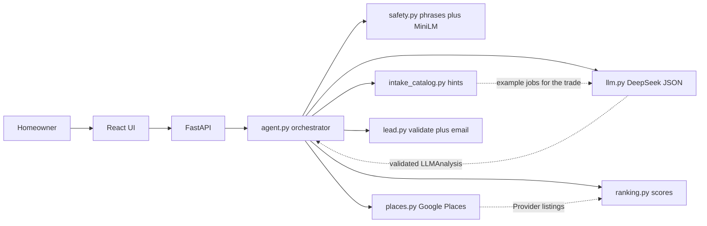

# Home-services lead agent

Internship take-home prototype: a homeowner describes a problem, the app gathers just enough detail, looks up **real** local businesses via Google Places, and produces a **dispatchable lead plus a draft email**. Nothing is sent to a provider.

This is a 10-hour vertical slice, not a production marketplace.

## What it does

1. Interprets a home problem with DeepSeek (`deepseek-flash`); a keyword classifier runs only if the model is down.
2. Asks **one** follow-up at a time (up to eight) while dispatch details are missing, using `intake_catalog.py` as optional hints, and stops as soon as a provider could act on it. City/ZIP is a header field, not a chat question.
3. Detects gas / fire / CO emergencies and **stops the lead funnel**.
4. Searches Google Places (New) Text Search; ranks with explainable scores.
5. Lets the user pick a listing (chat + filterable provider panel).
6. Collects name, phone or email, and street address **only with an explicit consent checkbox**.
7. Validates a structured lead and writes a first-person **draft** service request. "Open in email client" pre-fills it via `mailto:`; nothing is sent by the app.
8. Keeps state across refreshes (session id in `localStorage`, sessions in `backend/data/sessions.json`); **New lead** starts over without reloading.

## Quick start

You need Python 3.12+ and Node 20+. On Windows PowerShell, if `npm` is blocked, use `npm.cmd` or run `Set-ExecutionPolicy -Scope CurrentUser RemoteSigned`.

### 1. Keys (backend only)

```bash
cd backend
copy .env.example .env   # Windows
```

Edit `backend/.env`:

```
DEEPSEEK_API_KEY=
DEEPSEEK_BASE_URL=https://api.deepseek.com
DEEPSEEK_MODEL=deepseek-flash
GOOGLE_PLACES_API_KEY=
```

Never put keys in the frontend or commit `.env`.

Without `DEEPSEEK_API_KEY`, the agent still runs using a deterministic keyword classifier. Without `GOOGLE_PLACES_API_KEY` and with an empty fallback fixture, provider search returns no listings (it will **not** invent businesses).

### 2. Backend

```bash
cd backend
python -m venv .venv
.venv\Scripts\activate
pip install -r requirements.txt
python -m uvicorn app.main:app --reload --port 8000
```

Health check: [http://127.0.0.1:8000/api/health](http://127.0.0.1:8000/api/health)

### 3. Frontend

```bash
cd frontend
npm.cmd install
npm.cmd run dev
```

Open [http://127.0.0.1:5173](http://127.0.0.1:5173). Vite proxies `/api` to port 8000.

### 4. Tests and eval

```bash
cd backend
python -m pytest -q
python eval/run_eval.py
python scripts/smoke_llm.py
```

`python eval/run_eval.py --record-fixture` saves a **live** Places response into `fixtures/fallback_providers.json` for offline demos. That file starts empty on purpose. Places terms restrict caching; treat this as **dev-only**.

## Architecture

Probabilistic AI reasoning is isolated from deterministic orchestration.



| The LLM may | Application code must |
|---|---|
| Interpret the problem | Own conversation `Stage` |
| Guess category/urgency with confidence | Validate with Pydantic |
| Extract facts and **one** next question | Cap questions at 8, drop redundant / contact / location questions, merge facts |
| Rephrase catalog hints for the current trade | Inject example jobs for that trade after the model picks a category; never skip DeepSeek because of a catalog hit |
| Flag possible hazards | Run safety **first** (phrases + MiniLM recall, then negation); never skip 911 copy |
| Summarize the problem | Call Places; never let the model name businesses |
| Invent questions when no catalog match | Rank with points + reason strings |
| | Gate the lead on required fields + consent |
| | Render the email from validated data only |

### API

| Method | Path | Purpose |
|---|---|---|
| `GET` | `/api/health` | Key presence and `live` vs `fallback` search |
| `POST` | `/api/sessions` | Create a session + greeting |
| `GET` | `/api/sessions/{id}` | Full state for the UI (used to restore after refresh) |
| `POST` | `/api/sessions/{id}/messages` | One user turn |
| `POST` | `/api/sessions/{id}/location` | Set city/ZIP from the header field |
| `POST` | `/api/sessions/{id}/providers/search` | Manual panel search |
| `POST` | `/api/sessions/{id}/select` | Choose a listing |
| `POST` | `/api/sessions/{id}/contact` | Contact + address + consent → lead/email |

Sessions live in a process dict and are written to `backend/data/sessions.json` after every turn (gitignored, contains PII). A per-session lock serializes concurrent requests. This is single-process demo persistence, not multi-worker safe.

## Conversation stages

`gathering` → (optional) `need_location` → `searching` → `showing_providers` or `no_results` → `collecting_contact` → `lead_ready`

`safety_escalated` is a hard stop for gas leak, active fire/smoke, or carbon monoxide. Sparking outlets and floodwater near electrical equipment add caution text and force **emergency** urgency but still allow finding an electrician / water-damage provider.

Follow-up questions: DeepSeek always classifies the job when the API key is set. After a trade is known, `intake_catalog.py` injects example jobs and questions for that trade as optional hints — not a keyword match, not an embedding retrieval, and not a questionnaire. The model writes the question and decides what is already answered. Safety uses phrase lists plus MiniLM cosine against those phrases (typos/paraphrases such as `gass`), then negation so `I no longer smell gas` does not hold. `The gas stove will not light` stays below the hazard threshold. Niche work (solar, pool, septic, EV charger, smart lock) has no catalog row; the model should ignore the hint list for those.

Users can type that they are safe to resume after an escalation.

## Provider matching

Deterministic score, then top listings:

- +3 category `primaryType` match, **or** +2 if the business name confirms the trade (Google types most restoration, roofing, and HVAC shops as `general_contractor`, so the name is often the only signal)
- +2 phone on the listing
- +1 website
- +0–2 Bayesian Google rating (prior 3.5 / 10 reviews) — **listing signal, not a quality claim**
- +1 address contains the requested city or ZIP
- −2 for a no-address listing whose phone area code matches none of the locally addressed results (likely a national lead-gen call center)

Service-area businesses are kept (`includePureServiceAreaBusinesses: true`) and labeled **service area not confirmed**.

Field mask (cost control): `id, displayName, formattedAddress, nationalPhoneNumber, websiteUri, googleMapsUri, rating, userRatingCount, primaryType, primaryTypeDisplayName, businessStatus, pureServiceAreaBusiness`.

Phone and website fields are a higher Places SKU. Only `OPERATIONAL` listings are shown.

**Attribution:** listings are Google data. The panel includes a “Powered by Google” note. Opening Maps uses the listing’s `googleMapsUri`.

## Lead completeness

Required: problem summary, known category, urgency, city or ZIP, service address, selected provider, customer name, phone **or** email, `consent_to_share=true`.

Optional: extra fact dictionary.

Statuses: `complete` | `incomplete` | `safety_escalated`.

## Assumptions and tradeoffs

- Default demo geography is **Austin, TX**, but any city/ZIP the user (or panel) supplies is used in the text query.
- “Nearby” is **query-scoped**, not haversine distance. There is no geocoding step in this slice.
- A Google listing is **not** proof of license, insurance, availability, or service area.
- JSON mode on DeepSeek is requested; if the model rejects `response_format`, the client retries without it, then validates, then falls back to keywords.
- A JSON file is enough persistence for a local demo; it is not a database.
- The fallback fixture is empty until you record a live response. Empty results are preferred over fictional plumbers.
- Email is a draft only. Google Places has **no business email field**, so "Open in email client" leaves To blank unless the listing has one; the user sends it themselves, or calls.
- Service address is required: a contractor cannot act on a lead without knowing where to go.

## Evaluation (measured on this machine)

Command: `python eval/run_eval.py`. Full table: [backend/eval/results.md](backend/eval/results.md).

Latest funnel run (recorded before catalog embeddings were removed): **live DeepSeek (`deepseek-flash`) + live Google Places**, **20 scenarios**. Re-run `python eval/run_eval.py` after this change; numbers below are historical.

| Proxy | Result | Meaning |
|---|---|---|
| Category match | **20/20** | Including want≠pest, ants→pest, garage door→handyman, smart lock→handyman |
| Urgency in expected set | **19/20** | Flickering lights came back `flexible` on a path that skipped DeepSeek; that skip is gone |
| Escalation correctness | **20/20** | Gas and CO held; “not everyone is safe” did not clear; negated gas did not trigger |
| Edge-case checks | **20/20** | 911 copy, no search on hold, caution vs hold, lead lock |
| Funnel completion (non-emergency) | **17/17** | The three emergencies correctly never completed |
| Quality-checked leads (non-emergency) | **17/17** | Chosen provider's trade confirmed and not flagged as a call center |

How to read these honestly:

- **Funnel completion is not conversion.** The script answers follow-ups from a fixed list, auto-selects the top listing, and submits contact details. It proves the agent never gets stuck; real users can still drop off at any step.
- **Quality-checked is not acceptance.** It checks that the lead went to a business that plausibly does this work. Whether a provider would take the job needs a provider-side accept/decline loop.
- DeepSeek occasionally fails a turn (network or invalid JSON). The keyword fallback kept those scenarios moving, which is the point of the fallback.

Sample **success path** (the brief's example, ZIP 78717): "Water started coming into my basement last night after the storm" → asks whether water is near electrical, then about a sump pump → live water-restoration listings → select → contact + address + consent → JSON lead + first-person draft email.

Sample **safety path** (gas smell): first message → rule-based hold + model-written 911 copy → `safety_escalated` → no provider search.

## What to build next for production

- Persist sessions and leads in Postgres instead of a JSON file; encrypt PII at rest.
- Geocode ZIP → lat/lng and rank by distance / service radius.
- License, insurance, and “accepts this job type” checks with a provider network, not Places alone.
- Provider-side accept/decline loop and true conversion analytics.
- Streaming tokens, observability, rate limits, and abuse controls.
- Human review for safety-escalated transcripts.
- Proper PII retention, consent logging, and Places caching policy review.
- Auth so a homeowner can return to a draft from another device.
- Instrument the real funnel (message → search → select → contact) to measure human drop-off, not scripted completion.

## Project layout

```
backend/app/     FastAPI, models, agent, llm, intake_catalog, safety, safety_embed, places, ranking, lead
backend/eval/    scenarios.json, run_eval.py, results.md
backend/tests/
frontend/src/  React + Vite + Tailwind
```

Dependencies are only those in `backend/requirements.txt` and `frontend/package.json`.
